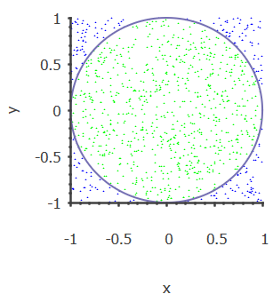
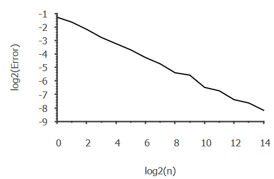

# Monte Carlo approximation of $\pi$
This program generates a given number of uniformly distributed random points on the interval ($x, y \in [-1, 1]$).

It then determines the euclidian norm of every point relative to the origin, and whether that point is located inside or outside the unit circle ($|\textbf{x}| = |(x, y)| = \sqrt{x^2 + y^2} \leq 1$).

After this, the program counts the number of points inside and outside the unit circle, respectively, and calculates the ratio of the points inside the circle over the total amount of points ($q_N = \frac{N_{inside}}{N_{total}} = \frac{N_{inside}}{N_{inside} + N_{outside}}$). 

Area of square with length 2: $A_{s} = 2^2 = 4$
Area of circle with radius 1 (unit circle): $A_{c} = \pi \cdot 1^2 = \pi$
Ratio of their areas: $q_A = \frac{A_{c}}{A_{s}} = \frac{\pi}{4} \Rightarrow \pi = 4 \cdot \frac{A_{c}}{A_{s}} \approx 4 \cdot q_N$. 

This is how $\pi$ is approximated in the Monte Carlo method.

# Relevant features of the code

## ```plot_points```
The function plot_points plots the generated points as blue if they are outside the unit circle, and green if they are inside. Finally, it plots the unit circle as a reference:



Example plot from running ```plot_points```.
## ```plot_error```
The function plot_error plots the relative error of the approximated value of $\pi$ as compared to the analytic value, here taken as $\pi_{actual} = 4 \cdot \arctan(1)$, against the number of generated points.

The plotting is done on a log-log scale (binary logarithm) in order to show the error as linearly decreasing:



An example plot from running ```plot_error```.

### Error analysis
A quick calculation of the slope ($k = -0.492129 \approx -0.5$) implies that the error decreases as the inverse square root of $N_{total}$: 
$$\varepsilon \approx  O(N_{total}^{-0.5}) = O(\frac{1}{\sqrt{N_{total}}}).$$

This is consistent with the theoretical value of the error convergence rate, which can be calculated from the variance. 

Thus it can be concluded that the MC estimation of $\pi$ is good, but not very efficient. Series, such as the Chudnovsky formula, are better in this regard.

# Disclaimers
The function comments were generated by AI, tweaked by me afterwards. 

There is no handling of inputs or errors in this program, which should be implemented. I am prioritizing learning numerical methods for now, but might return to finish this work. 
